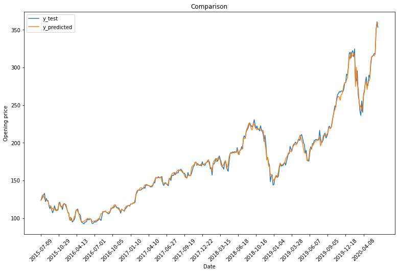

# *Stock price prediction using Recurrent Neural Network*

## Overview

Using Tensorflow, a Recurrent Neural Network (RNN) model was trained to predict the next day opening price using the past 3 days Open, High, and Low prices and volume. The given dataset conatains stock price prediction for 5 years with one sample per day. For training purpose, a new dataset was created by using the latest 3 days as the features and the next day’s opening price as the target. So each sample contains 12 features and 1 target. The new dataset was randomized and split it into 70% training and 30% testing. It was saved to ‘train_data_RNN.csv’ and ‘test_data_RNN.csv’ in the data directory respectively
### RNN Model

- LSTM layer with 50 LSTM units
- LSTM layer with 50 LSTM units
- LSTM layer with 50 LSTM units
- Dense layer having 1 neuron

### Arguments
- Batch size = 64
- Adam as the optimizer 
- Mean squared error as loss function
- Each network was trained for 1500 epochs.

### Plot of the true and predicted values

